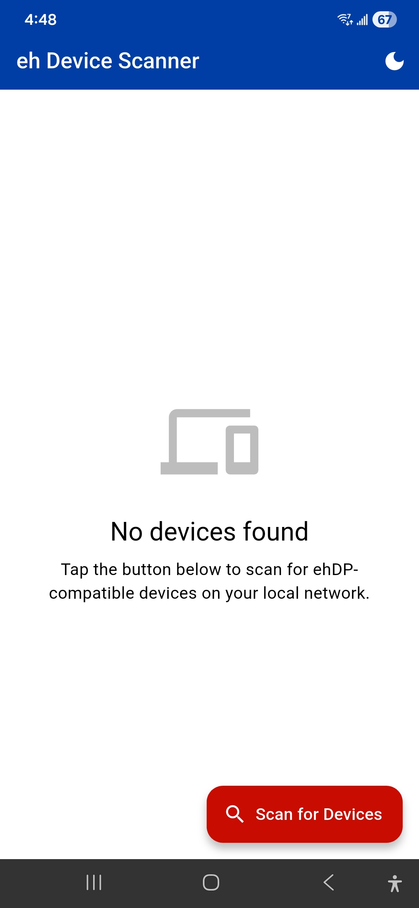
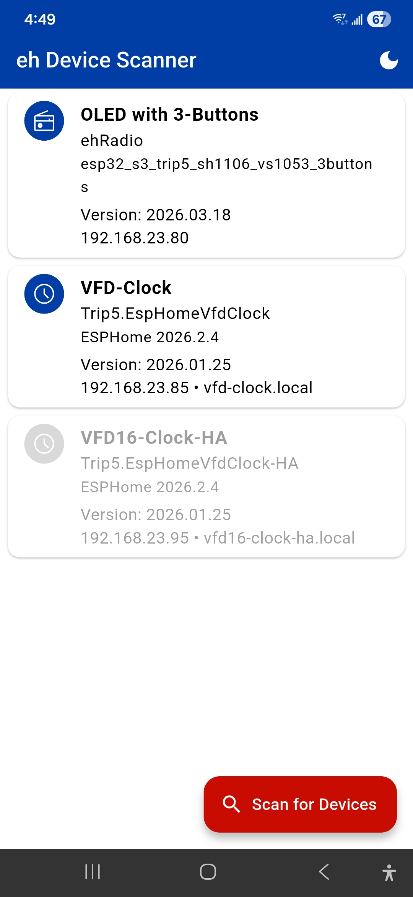
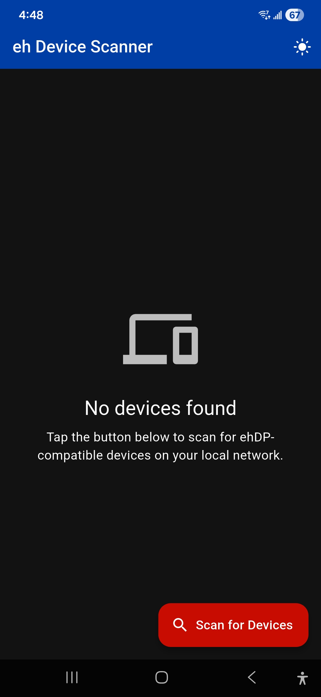
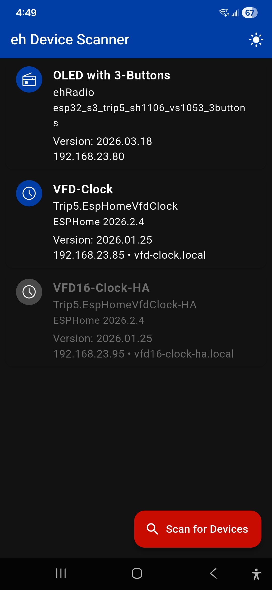

# eh Device Scanner

## Overview

eh Device Scanner is a mobile app for discovering devices on your local network (if the device is equipped with the eh Discovery Protocol).

[ehDP](https://github.com/trip5/ehDP) is a simple and lightweight discovery protocol designed for local networks.

The app sends UDP broadcast packets on your local network and displays responding devices in a simple, easy-to-use interface.

Click on the device name and the device's WebUI will be launched in your default browser.

The app only performs local network scanning to discover devices on your network. All device discovery happens locally on your device and network. No data leaves your device.

Unfortunately, I know very little about coding for a mobile app so a lot of this was generated by Github's co-pilot.  As a result, I kept its functionality very basic. It requires no permissions.

Pull requests, forks, and other implementations are always welcome.

## Features

- Fast: Single UDP broadcast discovers all devices in seconds
- Zero-config: No setup required, just tap and scan
- Device Details: Displays useful device information, including name and IP address
- Web UI Access: Opens device web interfaces in your system browser

## ehDP Protocol

This app implements the `ehDP v1` protocol specification. ehDP is a lightweight, UDP-based discovery protocol designed for ESP8266/ESP32 and similar IoT hardware.

It is a discovery protocol implementable in Arduino and ESPHome-based firmware.  Read more about the protocol (and projects that use it) [here](https://github.com/trip5/ehDP).

## Installation

### Google Play Store
1. Join the [Google Groups](https://groups.google.com/g/eh-device-scanner) (required for early testers)
2. Install from [Play Store](https://play.google.com/apps/testing/com.ehdevices.eh_device_scanner) (may require joining the group)

### Android
1. Download APK from [Releases](https://github.com/trip5/eh-Device-Scanner/releases).
2. Enable "Install from Unknown Sources"
3. Install and launch

### iOS
- Requires Mac for building (coming soon?)

## Usage

1. Connect to WiFi
2. Tap "Scan for Devices"
3. Wait 2-3 seconds
4. Tap device to open web UI in your mobile browser

### Light Mode

 

### Dark Mode

 

---

## Links

- [Google Groups](https://groups.google.com/g/eh-device-scanner) (required for early testers)
- [Play Store](https://play.google.com/apps/testing/com.ehdevices.eh_device_scanner) (may require joining the group)
- [ehDP Protocol & Libraries](https://github.com/trip5/ehDP)

---

## Update History

| Date       | Version | Release Notes             |
| ---------- | ------- |-------------------------- |
| 2026.03.22 | 1.0.0   | First release             |

---

## License

Licensed under GNU Lesser General Public License v2.1 (LGPL-2.1).

See [LICENSE](LICENSE) for details.

Forks must use different branding.
